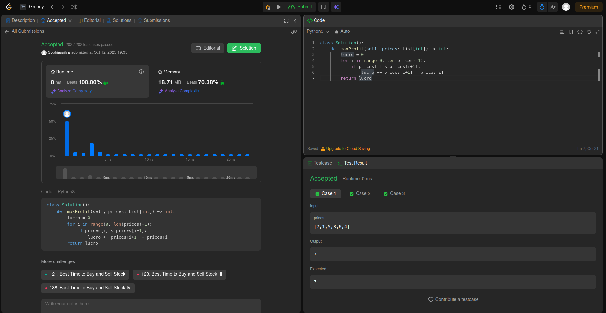
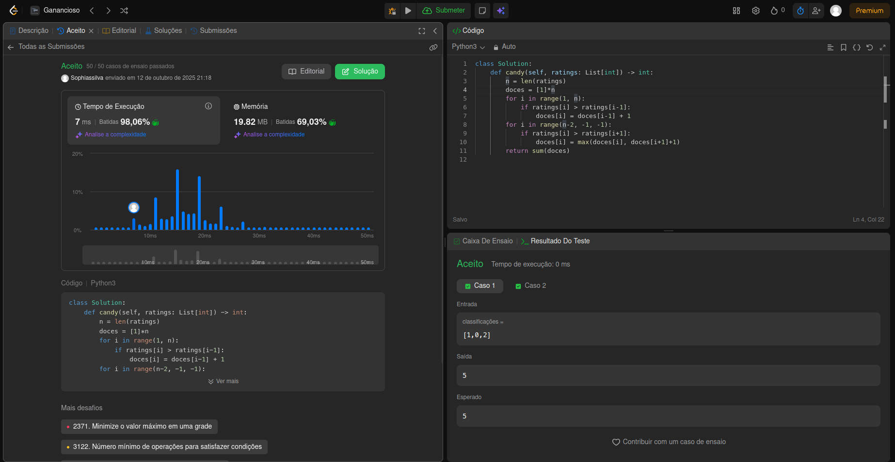
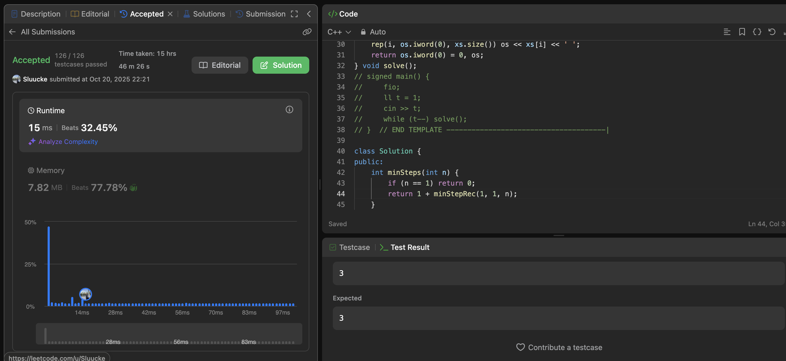
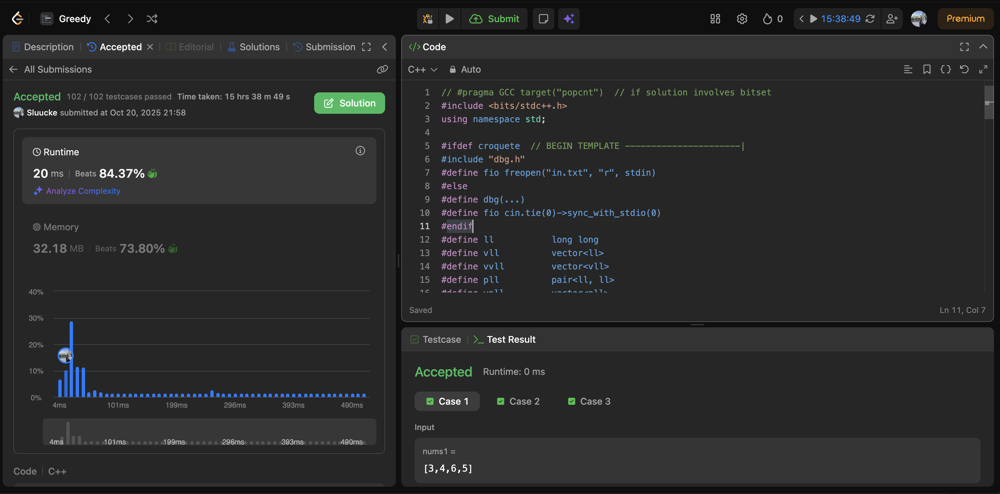

# Ambiciosos

**Número do trabalho:** 3  
**Conteúdo: Algoritmos ambiciosos**

## Discentes

| Matrícula |        Nome Completo         |
|:---------:|:----------------------------:|
| 232001649 | David William Lemos Ferreira |
| 231026886 | Sophia Souza da Silva        |

## Definição do Trabalho

Para este segundo trabalho, decidimos resolver questões do leetcode.

## Linguagens utilizadas

Utilizamos as linguagens C++ e Python para resolução das questões.

## Questões

| Questão | Nível  |
|---------|--------|
| [122. Best Time to Buy and Sell Stock II](https://leetcode.com/problems/best-time-to-buy-and-sell-stock-ii) | Médio |
| [135. Candy](https://leetcode.com/problems/candy/description/) | Difícil |
| [650. 2 Keys Keyboard](https://leetcode.com/problems/2-keys-keyboard) | Médio |
| [321. Create Maximum Number](https://leetcode.com/problems/create-maximum-number) | Difícil |

## Screenshots

### Exercício 01 - Best Time to Buy and Sell Stock II

### Exercício 02 -

### Exercício 03 -

### Exercício 04 -

### Vídeo
